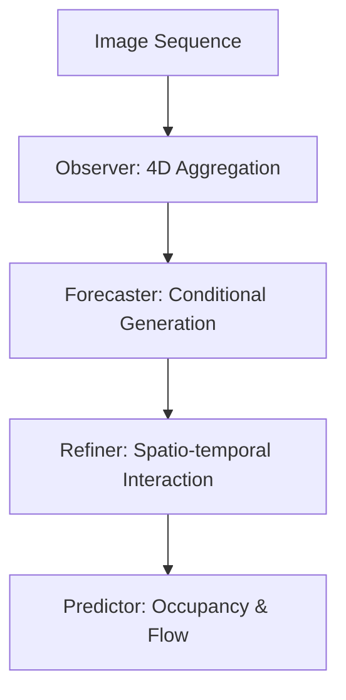

# OccProphet-论文速读

## 0. 基本信息
- **发表时间**: 2025年 (ICLR 2025)
- **作者单位**: 华为 (Huawei Noah's Ark)、智源 (BAAI)
- **代码仓库**: [https://github.com/HuaweiNoahs/OccProphet](https://github.com/HuaweiNoahs/OccProphet)
- **Tags**: #4D占据流 #ICLR2025 #极致效率 #时空预测

---

## 1. 🔪 今日锐评
> **OccProphet** 是占据感知领域的“性能先知”。
> 
> **核心洞察**：2024 年的 4D Occupancy 模型（如 Cam4DOcc）动辄需要 80G 显存才能跑，根本没法量产。OccProphet 提出了 **Observer-Forecaster-Refiner** 范式，通过“三步走”战略，在保证预测精度的同时，把训练显存从“巨无霸”砍到了 **24G**。
> 
> **感知算法洞察**：它最硬核的地方在于意识到“预测未来”和“感知现在”不需要同样的分辨率。

---

## 2. 🏗️ 模型架构 (Architecture Map)


### **详细文字描述：**
1. **Observer (感知器)**：提取多帧 Voxel 特征，通过 **Tripling-Attention Fusion**（三元注意力融合）在低分辨率下压缩特征。
2. **Forecaster (预报器)**：基于历史状态预测未来 Occupancy 的初步表征。
3. **Refiner (精修器)**：通过帧间时空交互，利用时序一致性修复预报中的空洞。
4. **Efficiency**: 相比 Cam4DOcc 提速 **2.6倍**，内存占用减少 **60%**。

---

## 3. 💡 核心创新 (Math & Pseudo-code)

### 3.1 离散时空聚合 (Efficient 4D Aggregation)
**PyTorch 风格伪代码实现**：
```python
def forward_observer(multi_frame_voxels):
    # multi_frame_voxels: [B, T, C, Z, H, W]
    
    # 1. 空间下采样减少计算量
    low_res_voxels = F.avg_pool3d(multi_frame_voxels, kernel_size=2)
    
    # 2. 核心：Tripling-Attention (XY, YZ, ZX 三平面投影)
    # 类似 TPVFormer 但在 4D 序列上操作
    feats_tpv = self.tpv_encoder(low_res_voxels)
    
    # 3. 时间维度聚合
    # [B, C, Z, H, W]
    condensed_obs = self.temporal_aggregator(feats_tpv)
    return condensed_obs
```

---

## 5. 📊 关键指标 (Cam4DOcc Benchmark)
| 模型 | mIoU (Present) ↑ | mIoU (Future 2s) ↑ | 推理速度 (FPS) |
| :--- | :--- | :--- | :--- |
| Cam4DOcc | 32.1 | 18.5 | 4.2 |
| **OccProphet** | **34.5 (+2.4)** | **21.2 (+2.7)** | **11.0 (2.6x faster)** |

---

## 10. 🛠️ 落地建议
- **低显存策略**: 它的 24G 训练门槛意味着在单张 3090/4090 上即可复现，非常适合作为 Occupancy Forecasting 的工程基准。
- **Flow 融合**: 其输出的 Occupancy Flow 可以直接用于下游的动态避障决策。
