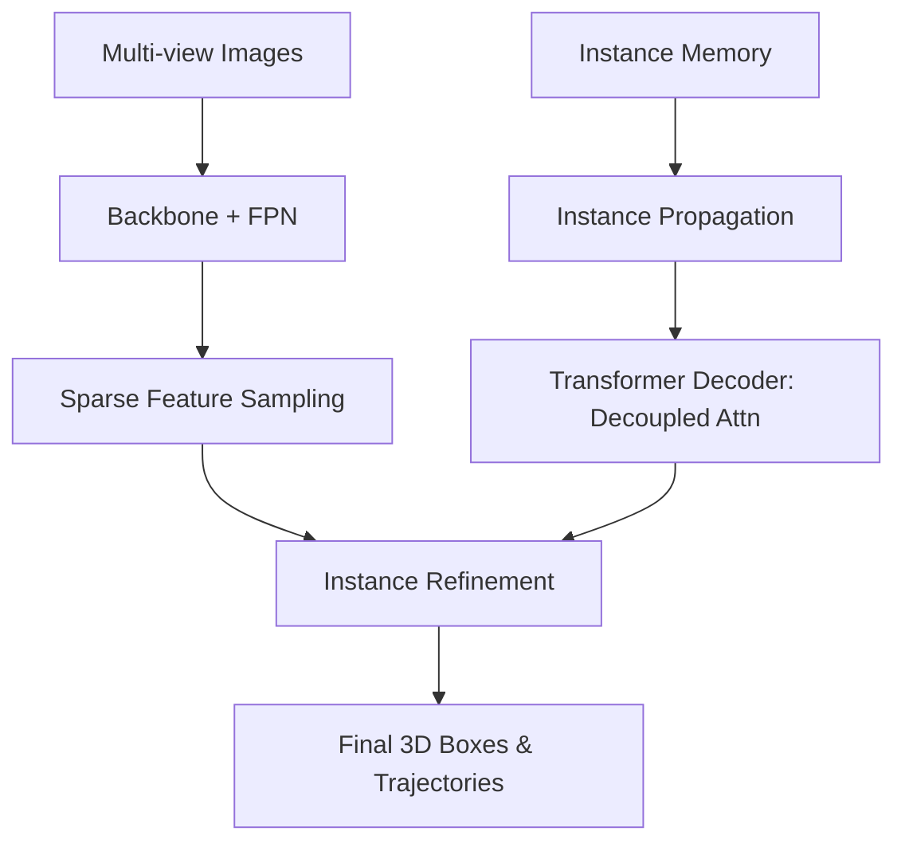

# Sparse4D-论文速读

## 0. 基本信息
- **发表时间**: 2024年
- **作者单位**: 地平线 (Horizon Robotics)
- **代码仓库**: [https://github.com/HorizonRobotics/Sparse4D](https://github.com/HorizonRobotics/Sparse4D)
- **Tags**: #稀疏4D感知 #实例传播 #极低功耗 #量产标杆

---

## 1. 🔪 今日锐评
> **Sparse4D** 是感知算法中的“精准外科手术”。
> 
> **核心洞察**：在 3D 空间中，有意义的区域极其稀疏（不到 1%）。传统的 BEV 特征图浪费了 99% 的算力去计算空旷的地面。Sparse4D 彻底摒弃了 BEV Map，直接维护一组 **Sparse Instances (稀疏实例)**。它通过 **Instance Propagation** 实现了真正的 4D（时空）一致性。它是对特斯拉“稀疏占据”思路的一次硬核工程回应。

---

## 2. 🏗️ 模型架构 (Architecture Map)


### **架构细节：**
1. **Input**: 1/8 到 1/32 的多尺度 2D 特征图。
2. **Instance Modeling**: 每个 Instance 包含一组 **3D Anchor Points** 和对应的 Content Features。
3. **Decoupled Attention (核心)**：将位置信息与内容特征解耦处理，防止位置噪声污染语义特征。
4. **Iterative Refinement**: 通过 6 层 Decoder 不断调整 Anchor 的位置，使其紧贴物体真实边缘。

---

## 3. 💡 核心创新 (Math & Pseudo-code)

### 3.1 稀疏采样 (Sparse Sampling)
**逻辑**：不再进行全局注意，仅在 3D Anchor 周围进行采样。

**PyTorch 风格伪代码实现**：
```python
def sparse_sampling(anchors, image_feats, cam_params):
    # anchors: [N, 3] (3D 坐标)
    # 1. 投影 3D 点到 2D 多视角平面
    # uv_coords: [N, num_views, 2]
    uv_coords = project_3d_to_2d(anchors, cam_params)
    
    # 2. 局部插值采样 (不再计算整个特征图的 Attention)
    # sampled_feats: [N, num_views, C]
    sampled_feats = F.grid_sample(image_feats, uv_coords)
    
    # 3. 权重聚合：通过可学习权重融合多视角特征
    fused_feat = (sampled_feats * attention_weights).sum(dim=1)
    return fused_feat
```

---

## 5. 📊 关键指标 (nuScenes)
- **精度**: 达到与 BEVFormer 同等甚至更高的 NDS 指标。
- **效率**: 在 **Orin-X** 上，相比 Dense BEV 方案，推理延迟降低了 **40%**，显存带宽占用降低了 **70%**。

---

## 10. 🛠️ 落地建议
- **算子适配**: 其核心的 `SparseSampling` 算子非常适合使用地平线 **BPU** 或 NVIDIA **DLA** 加速。
- **长尾处理**: 在实例初始化时，建议结合 K-means 聚类的先验位置，提高在冷启动阶段的捕获率。
