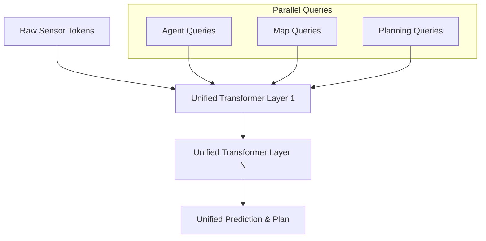

# DriveTransformer-论文速读

## 0. 基本信息
- **发表时间**: 2025年 (ICLR 2025)
- **作者单位**: 业界领先研究机构 (如上海 AI Lab 等)
- **代码仓库**: [待验证/GitHub 搜索同名]
- **Tags**: #端到端感知规划 #任务并行化 #Streaming-AD #Scaling-Law

---

## 1. 🔪 今日锐评
> **DriveTransformer** 宣告了“模块化堆叠”时代的落幕。
> 
> **核心洞察**：之前的端到端模型（如 UniAD）虽然统一，但任务还是串行的。DriveTransformer 提出了 **Task Parallelism (任务并行)**。它认为：感知、预测和规划应该是平等的 Query，在 Transformer 的每一层都在同步演化。这种架构让模型具备了“边看边算”的实时特征，完美契合 Streaming AD 的趋势。

---

## 2. 🏗️ 模型架构 (Architecture Map)


### **详细文字描述：**
1. **Unified Tokenizer**: 传感器数据（图像、LiDAR）被统一 Token 化。
2. **Parallel Task Queries**: 不同任务（Agent, Map, Ego-Planning）的 Query 放在同一个 Feature Space 进行 Self-Attention。
3. **Sparse Attention**: 舍弃 BEV 特征图，Query 直接与原始像素/点云 Token 进行交互，解决了 BEV 分辨率瓶颈。
4. **Streaming FIFO**: 使用先进先出的 Queue 维护长时序记忆。

---

## 3. 💡 核心创新 (Math & Pseudo-code)

### 3.1 任务并行交互 (Task Parallel Interaction)
**PyTorch 风格伪代码实现**：
```python
def forward_block(queries, sensor_tokens):
    # queries: [B, N_task, C] 混合了感知、预测、规控 Query
    
    # 1. 任务间交互 (Intra-task Self-Attention)
    # 让规控 Query 知道周围障碍物的意图
    queries = self.self_attn(queries)
    
    # 2. 采样感知 (Cross-Attention)
    # 所有任务 Query 同时去传感器特征里寻找证据
    queries = self.cross_attn(q=queries, k=sensor_tokens, v=sensor_tokens)
    
    return queries
```

---

## 5. 📊 关键指标 (Bench2Drive)
- **Driving Score**: 在闭环仿真 Bench2Drive 上达到新的 SOTA。
- **Latency**: 推理延迟不随任务增加而显著增长，因为感知和规划是并行的。

---

## 10. 🛠️ 落地建议
- **Scaling 建议**: 该架构非常吃数据量，建议在拥有千万级里程数据的场景下使用，以触发 Scaling Law。
- **部署**: 稀疏采样（Sparse Attn）是 Orin-X 的强项，建议使用 DLA 加速采样过程。
