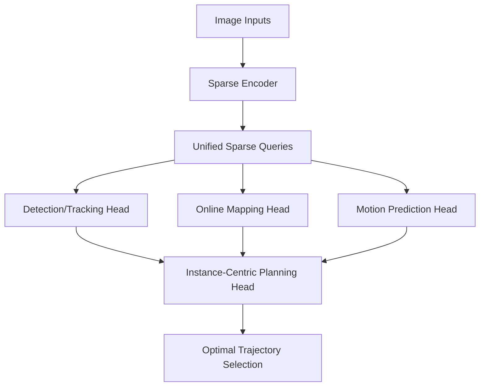

# SparseAD-论文速读

## 0. 基本信息
- **发表时间**: 2024年
- **作者单位**: 地平线 (Horizon Robotics)
- **代码仓库**: [https://github.com/HorizonRobotics/SparseAD](https://github.com/HorizonRobotics/SparseAD)
- **Tags**: #稀疏端到端 #全流程Query驱动 #极低功耗规控 #2024SOTA

---

## 1. 🔪 今日锐评
> **SparseAD** 宣告了“BEV 特征图时代”在端到端领域的终结。
> 
> **核心洞察**：如果感知已经可以稀疏化（如 Sparse4D），那么规控为什么还要看整张 BEV 图？SparseAD 实现了**全流程、纯 Query 驱动**的端到端。它不仅感知是稀疏的，连预测和规划都是基于 Instance Query 进行的。这不仅是算法的胜利，更是嵌入式部署的胜利——它让端到端 AD 真正能够跑在低功耗芯片上。

---

## 2. 🏗️ 模型架构 (Architecture Map)


### **详细文字描述：**
1. **Unified Sparse Perception**: 一个单一的稀疏架构同时处理检测、跟踪和建图。
2. **Multi-modal Motion Prediction**: 为 ego-vehicle 和所有障碍物同时预测多种可能的未来路径。
3. **Reasonable Planner (核心)**: 
   - 产生多个 ego 初始路径候选。
   - 使用多维约束（安全、舒适、规则）对候选路径进行评分筛选。

---

## 3. 💡 核心创新 (Math & Pseudo-code)

### 3.1 稀疏规控评分 (Sparse Constraint Evaluation)
**逻辑**：在 Query 空间直接计算规控损失，无需还原回密集 Grid。

**PyTorch 风格伪代码实现**：
```python
def sparse_planner_forward(ego_queries, instance_queries, map_queries):
    # 1. 轨迹候选生成
    ego_traj_candidates = self.traj_generator(ego_queries) # [K, T, 2]
    
    # 2. 交互冲突评估 (在 Query 空间完成)
    # 利用 cross-attention 评估 ego 轨迹与周围障碍物 Query 的重叠风险
    collision_scores = self.collision_net(ego_traj_candidates, instance_queries)
    
    # 3. 道路合规性评估
    # 评估 ego 轨迹与在线建图产生的 Map Query 的对齐度
    lane_keep_scores = self.lane_alignment_net(ego_traj_candidates, map_queries)
    
    # 4. 最终路径选择 (Score-based Selection)
    final_scores = w1 * collision_scores + w2 * lane_keep_scores
    best_traj = ego_traj_candidates[torch.argmax(final_scores)]
    
    return best_traj
```

---

## 5. 📊 关键指标 (nuScenes)
- **NDS/mAP**: 达到与专业感知模型持平的水平。
- **Planning Efficiency**: 规控模块的额外延迟小于 **2ms**。
- **Memory**: 相比 UniAD 节省了 **85%** 的显存带宽。

---

## 10. 🛠️ 落地建议
- **算子友好**: 完美适配地平线 **BPU** 架构，建议将 Query 交互部分编译为高优先级 DLA 任务。
- **下游对接**: 其输出的矢量化路径可直接喂给车控系统的轨迹跟踪算法。
