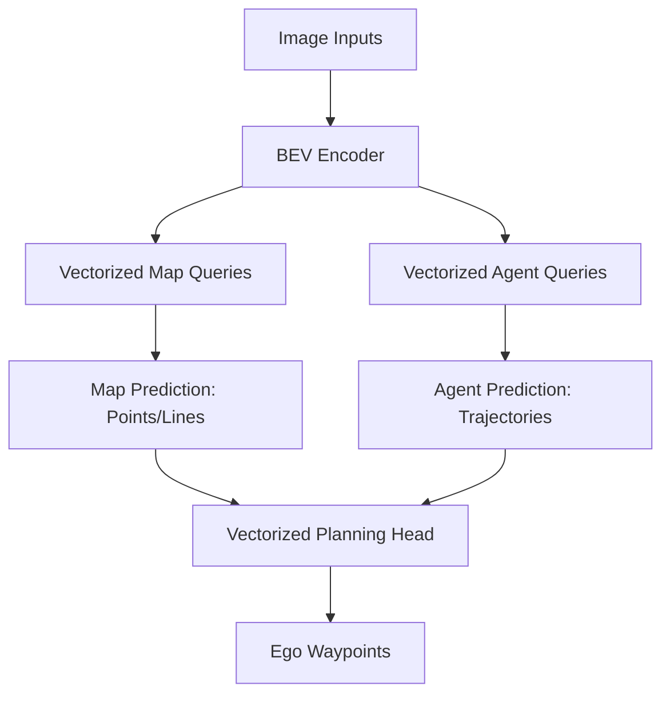

# VAD-论文速读

## 0. 基本信息
- **发表时间**: 2023年 (ICCV 2023)
- **作者单位**: 华中科技大学 (HUST)、地平线 (Horizon Robotics)
- **代码仓库**: [https://github.com/hustvl/VAD](https://github.com/hustvl/VAD)
- **Tags**: #矢量化端到端 #无图规划 #高效规控 #ICCV2023

---

## 1. 🔪 今日锐评
> **VAD** 是端到端领域的“减重先锋”。
> 
> **核心洞察**：UniAD 虽然强大但太重了，尤其是 OccFormer 对显存的吞噬。VAD 提出了一个尖锐的观点：**规控不需要看稠密的 Grid，只需要看矢量的线和点。** 它通过全矢量化表征，不仅让规划速度快了 3 倍，还彻底摆脱了对高精地图的依赖。

---

## 2. 🏗️ 模型架构 (Architecture Map)


### **详细文字描述：**
1. **Scene Vectorization**: 将场景抽象为 Agent Vectors 和 Map Vectors。
2. **Ego-Query Interaction**: Ego-query 直接与这些稀疏的矢量特征进行交互，计算量级从 $O(H 	imes W)$ 降至 $O(N)$。
3. **Map-less Planning**: 实时回归周围的车道线拓扑，实现在完全无图（Map-less）环境下的自动驾驶。

---

## 3. 💡 核心创新 (Math & Pseudo-code)

### 3.1 矢量化规划约束 (Vectorized Constraints)
**逻辑**：在 Loss 中显式加入轨迹点到矢量化边界的距离惩罚。

**PyTorch 风格伪代码实现**：
```python
def vectorized_planning_loss(pred_traj, map_vectors, agent_vectors):
    # pred_traj: [T, 2] (预测的轨迹点)
    
    # 1. 地图边界约束 (Keep inside lanes)
    # 计算预测点到最近车道线矢量的距离
    dist_to_lane = compute_min_dist(pred_traj, map_vectors)
    loss_map = torch.mean(F.relu(dist_to_lane - margin))
    
    # 2. 障碍物避障约束 (Collision Avoidance)
    dist_to_agents = compute_min_dist(pred_traj, agent_vectors)
    loss_agent = torch.mean(F.relu(safety_threshold - dist_to_agents))
    
    return loss_map + loss_agent
```

---

## 5. 📊 关键指标 (nuScenes)
- **Planning L2 Error**: **0.68m** (优于 UniAD 的 0.71m)。
- **推理速度**: 在 **Orin-X** 上单核可达 **15-20 Hz**，具备极强的量产潜力。

---

## 10. 🛠️ 落地建议
- **矢量化后处理**: 建议配合简单的矢量地图平滑算法，提升轨迹在狭窄弯道处的一致性。
- **内存优化**: 显存占用相比 UniAD 降低了约 50%。
