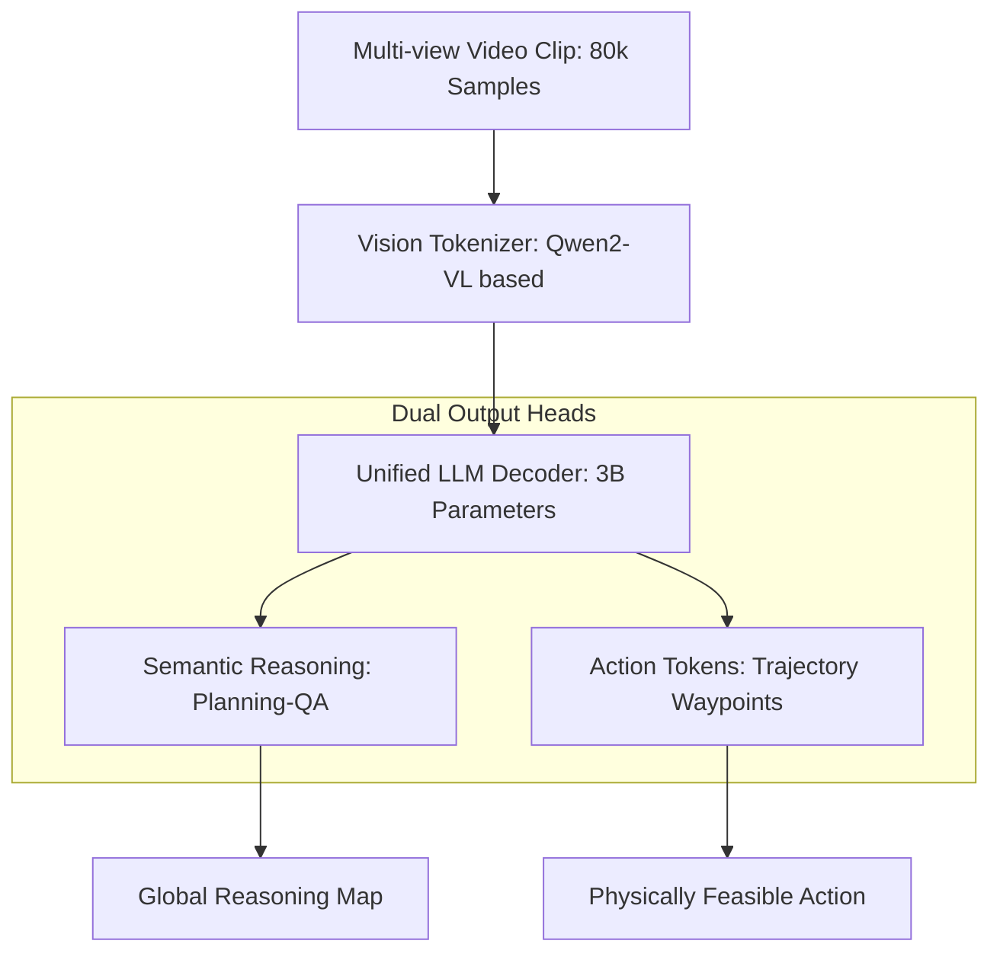

# Impromptu-VLA-论文速读

## 0. 基本信息
- **发表时间**: 2025年 (NeurIPS 2025)
- **作者单位**: 博世 (Bosch Research)、清华大学 (AIR & IIIS)
- **代码仓库**: [https://github.com/ahydchh/Impromptu-VLA](https://github.com/ahydchh/Impromptu-VLA)
- **Tags**: #开源VLA权重 #CornerCase数据集 #非结构化感知 #NeurIPS2025

---

## 1. 🔪 今日锐评
> **Impromptu VLA** 是 VLA 领域的“大公无私者”。
> 
> **核心洞察**：在各大厂都在私有化 VLA 权重和数据时，博世通过 Impromptu 贡献了 8 万条精心标注的非结构化（Unstructured）驾驶数据。它证明了：VLA 模型的瓶颈不再是参数量，而是如何让模型在“模糊路沿”、“突发施工”、“违规行人”这种长尾场景中保持逻辑一致性。
> 
> **感知工程师笔记**：如果你想训练自己的驾驶 LLM，Impromptu 是目前质量最高、最能提分的开源起始数据。

---

## 2. 🏗️ 模型架构 (Architecture Map)


### **详细文字描述：**
1. **Multimodal Tokenizer**: 将多视角视频序列转化为视觉 Token。
2. **Backbone**: 基于 **Qwen2-VL-3B**，在 3B 参数规模下实现了推理能力与计算效率的最优平衡。
3. **Dual Thinking Mode**: 
   - **Fast thinking**: 直接生成轨迹 Token，降低推理延迟。
   - **Slow thinking**: 先生成 Planning-oriented QA 推理链，再输出动作。
4. **Output Space**: 包含语义解释文本和离散化的轨迹点坐标。

---

## 3. 💡 核心创新 (Math & Pseudo-code)

### 3.1 跨域数据蒸馏 (Dataset Distillation)
**创新点**：从 200 万个原始剪辑中蒸馏出 8 万个高质量 Corner Cases，重点覆盖“边界模糊”和“临时规则变更”场景。

### 3.2 多任务统一损失 (Joint VLA Loss)
**PyTorch 风格伪代码实现**：
```python
def compute_impromptu_loss(vision_tokens, gt_text, gt_traj):
    # 1. 前向传播
    # logits: 语义推理预测, pred_traj: 物理轨迹预测
    logits, pred_traj = self.model(vision_tokens)
    
    # 2. 语义损失 (Reasoning Loss)
    # 监督 Planning-oriented QA 逻辑
    loss_text = F.cross_entropy(logits, gt_text)
    
    # 3. 动作损失 (Planning Loss)
    # 使用 L2 距离监督轨迹点对齐
    # [B, T, 2]
    loss_action = F.mse_loss(pred_traj, gt_traj)
    
    # 4. 联合优化
    # lambda_act 动态平衡推理与驾驶精度
    return loss_text + self.lambda_act * loss_action
```

---

## 5. 📊 关键指标
- **nuScenes Open-loop**: 3B 模型实现 **0.30m** 的 L2 轨迹误差（SOTA 级别）。
- **NeuroNCAP (Closed-loop)**: 闭环安全性评分提升了 **15%**，尤其在突发路障避让上表现卓越。

---

## 6. 📂 数据策略与预处理
- **Unstructured Taxonomy**: 数据集按 4 类非结构化特征分类：边界不全、规则跳变、奇行种障碍物、恶劣环境。
- **Action Tokenization**: 将连续空间离散化为特定精度的 Token，降低 LLM 预测坐标的幻觉率。

---

## 8. ⚠️ 长尾与局限
- **3B 限制**: 虽然 3B 模型快，但在极其复杂的交通枢纽（如 5 层交汇立交）的博弈逻辑仍略逊于 7B/13B 模型。

---

## 10. 🛠️ 落地建议
- **数据集回灌**: 强烈建议将 Impromptu 的 **80k Corner Case 数据** 作为公司内部模型的 Pre-training 增强包。
- **部署**: Qwen2-VL 支持高效的 TensorRT 量化，在 Orin-X 上建议开启 **Auto-AWQ** 4-bit 量化以获得极致 FPS。
