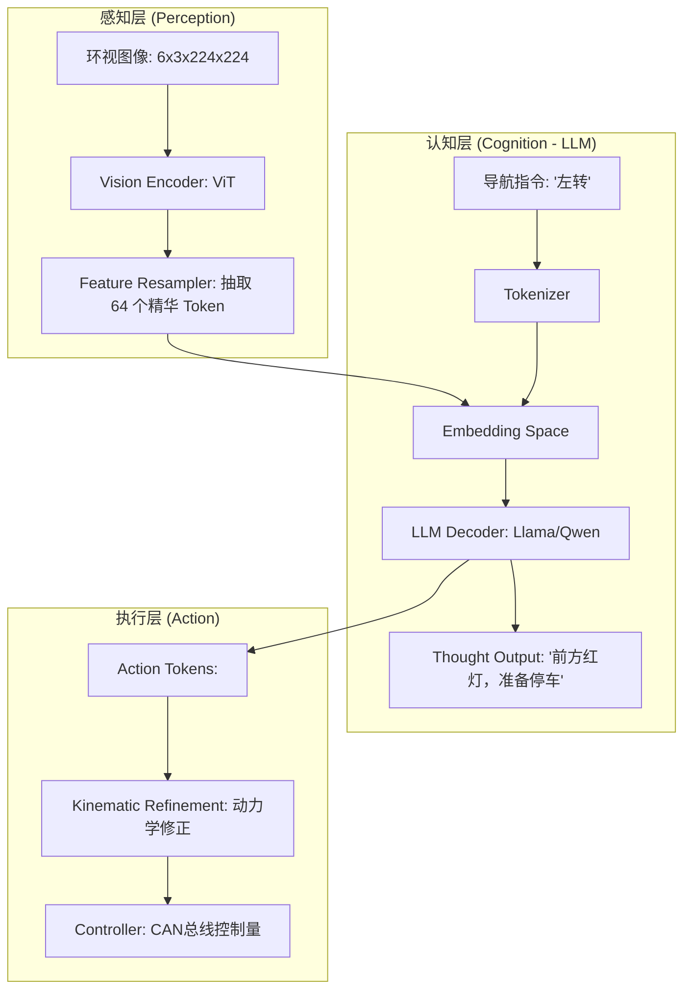

# 自动驾驶 VLA 算法手册 2.0 (初学者保姆级硬核版)

> **前言**：欢迎来到自动驾驶最前沿的阵地。如果你之前只听说过 YOLO 或者简单的分类网络，那么 VLA (Vision-Language-Action) 将会重塑你对“机器智能”的理解。本手册旨在通过最详尽的文字，带你走过智驾从“工具人”到“数字老司机”的全部进化历程。

---

## 第一部分：自动驾驶 VLA 算法概论 —— 范式大迁移

### 1.1 VLA 算法的概念及发展历史：从“公式”到“直觉”

#### **1.1.1 什么是 VLA？**
VLA 是 **Vision（视觉）**、**Language（语言）** 和 **Action（动作）** 三位一体的统称。
- **Vision (看)**：解决的是“环境里有什么”的问题。
- **Language (想)**：解决的是“我该怎么理解这些规则和意图”的问题。
- **Action (做)**：解决的是“手脚如何配合踩刹车和打方向盘”的问题。

#### **1.1.2 发展简史：四个时代的交替**
1.  **规则时代 (Rule-based, 2010-2016)**：感知只输出坐标，决策全靠 If-Else。例如：“如果 2 米内有车，就刹车”。这种方法无法处理复杂的环岛和博弈。
2.  **模块化深度学习时代 (Modular AI, 2016-2021)**：感知用 CNN，规控用优化算法。这是目前大多数 L2 辅助驾驶的现状。但感知和规控是断裂的，感知的一点点噪声都会导致规控剧烈抖动。
3.  **端到端时代 (Modular E2E, 2022-2023)**：以 **UniAD** 为代表，尝试把所有模块连成一根线。虽然变强了，但它是个“黑盒”，你不知道它为什么突然急刹。
4.  **VLA 认知智能时代 (2024-Now)**：引入 LLM。车不仅在开，还在“自言自语”地思考。它具备了处理从未见过的极端场景（Corner Case）的“常识”。

---

### 1.2 自动驾驶 VLA 任务解析：它到底在算什么？

VLA 任务的核心是将**非结构化的环境流**转化为**结构化的控制流**。

- **感知对齐任务**：模型需要将像素里的“红色团块”和文本里的“红灯”联系起来。
- **长程意图推理**：看到路边有个球滚出来，VLA 模型应该推理出“后面可能有小孩”，从而提前减速。这是传统感知网络绝对做不到的。
- **多模态指令遵循**：当你对车说“去前面路口靠边停一下”，模型需要解析“前面路口”是哪个像素区域，“靠边停”需要什么样的轨迹曲线。

---

### 1.3 开源 Benchmark 介绍：我们的“考场”在哪里？

对于初学者，你必须知道这几个数据集，它们是你训练和评估模型的“教科书”。

- **1.3.1 BDD100k**: 伯克利大学出品，包含了雨天、夜晚等各种恶劣工况，是视觉感知的基石。
- **1.3.2 nuScenes**: 智驾行业的“圣经”。它提供了环视 6 路相机、LiDAR、Radar 的全量对齐数据。如果你想搞 BEV 感知，nuScenes 是绕不开的第一站。
- **1.3.3 Bench2Drive**: 2024-2025 年最火的**闭环评测**基准。它不只看你预测得准不准，它真的在仿真器里跑你的模型，看你会不会撞车。
- **1.3.5 Impromptu-VLA Dataset**: 博世（Bosch）贡献的 8 万条专门针对 Corner Case 的数据集，是训练 VLA 逻辑推理能力的极品补丁。

---

### 1.4 VLA 常见评测指标：如何定义一个“好司机”？

#### **1.4.1 物理安全指标**
- **L2 Error**: 预测轨迹与老司机真实轨迹的平均欧式距离。越小代表模仿得越像。
- **Collision Rate (碰撞率)**: 闭环测试中发生碰撞的概率。这是端到端模型的红线。

#### **1.4.2 语义逻辑指标**
- **Language Score (BLEU/METEOR)**: 衡量模型输出的“思维链 (CoT)”文字与人类专家描述的相似度。
- **NavSim 得分**: 综合考量了路径规划的安全性、舒适度和效率。

---

## 第二部分：VLA 的算法基石 —— 感知、语言与动作的交汇

### 2.1 视觉感知基础：给模型一双 3D 的眼睛

#### **2.1.1 BEV 感知 (Bird's Eye View)**
- **定义**：把 6 路环视相机的图，通过数学变换投影到一张“俯视图”上。
- **初学者必懂逻辑**：为什么不直接看图？因为图像里“近大远小”，距离是不准确的。BEV 空间是**线性度量空间**，1 厘米就是 1 厘米，这对于规控（Planning）至关重要。
- **核心算子**：**LSS (Lift-Splat-Shoot)**。它的物理直觉是：把每个像素沿着深度方向“拉伸”成一根特征柱子，然后全部“拍扁”在地面上。

#### **2.1.2 3D 占据感知 (Occupancy / OCC)**
- **概念**：如果说 3D 检测是画“方框”，那么 Occupancy 就是玩“我的世界（Minecraft）”。它把空间分成无数个小方块（Voxel），告诉你每个方块是“空的”还是“有东西”。
- **优势**：它能识别“异形物体”。比如路上洒了一堆麻袋，检测框可能认不出来，但 OCC 能知道那里“有东西占据”，必须绕行。

---

### 2.2 Language 相关基础：给模型一个会思考的大脑

#### **2.2.1 序列建模与 Transformer**
- **核心直觉**：驾驶是一连串的动作。Transformer 的 **Self-Attention（自注意力）** 算子能够让模型关注到序列中最重要的那一帧。比如：即便后面有 10 辆车，Attention 会让模型死死盯着前面那辆刹车灯亮了的车。

#### **2.2.3 VL 的统一：从 ViT 到 LLaVA**
- **ViT (Vision Transformer)**：把图片当成文章来读。图片被切成 Patch，就像文章里的单词。
- **LLaVA 范式**：目前 VLA 的主流架构。它通过一个 **Adapter（适配器）** 模块，把视觉特征强行塞进大语言模型（如 Llama）的鼻子里，让 LLM 觉得它在“读”一幅画。

---

### 2.3 Action 相关基础：如何指挥手和脚？

#### **2.3.1 判别式解码器 (Discriminative)**
- **逻辑**：给出一堆预设好的候选轨迹（比如：直行、左转、紧急避让），模型选一个分最高的。
- **缺点**：灵活性差，无法应对精细的微调。

#### **2.3.2 生成式解码器 (Generative)**
- **逻辑**：像 LLM 写文章一样，一个点一个点地“写”出未来的轨迹。
- **主流技术**：**Diffusion Head（扩散模型头）**。它先画一团乱糟糟的噪声，然后根据视觉和语义信息，不断精修，最后变成一条优雅、平滑的 S 形避让曲线。

---

### 2.4 大模型与智驾 VLA 碰撞的火花：2025 年的核心科技

#### **2.4.1 CoT 技术 (Chain of Thought)**
- **初学者必背**：CoT 是让模型输出动作前先“碎碎念”。
- **公式**：$P(Action | Vision, Language) = P(Action | CoT) \times P(CoT | Vision, Language)$。
- **意义**：这增强了模型的逻辑一致性。如果它“想”的是减速，它“做”的时候就不敢加速。

#### **2.4.2 训练范式：SFT 与 强化学习 (GRPO)**
- **SFT (监督微调)**：这是“照猫画虎”。老司机怎么开，模型就怎么学。
- **强化学习 (后训练)**：这是“考场试错”。模型在仿真里开，撞了就扣分，开得稳就加分。2025 年最火的是 **GRPO**，它不需要昂贵的评价模型（Critic），让模型在一组候选轨迹里“自省”出最优解。

#### **2.4.3 MoE (Mixture of Experts) 多专家架构**
- **通俗解释**：不要用一个大脑处理所有事。专门分出“高速专家”、“泊车专家”、“雨天专家”。
- **DeepSeek MoE 启示**：通过极细粒度的专家分工，可以在不增加算力消耗的前提下，把 VLA 模型的容量提升到 100B 级别，使其具备接近真人的驾驶智慧。

#### **2.4.3 MoE (Mixture of Experts) 多专家架构**
- **通俗解释**：不要用一个大脑处理所有事。专门分出“高速专家”、“泊车专家”、“雨天专家”。
- **DeepSeek MoE 启示**：通过极细粒度的专家分工，可以在不增加算力消耗的前提下，把 VLA 模型的容量提升到 100B 级别，使其具备接近真人的驾驶智慧。

---

### 2.5 VLA 标准 Pipeline 深度解剖 (感知工程师必读)

在进入具体算法前，你需要掌握 VLA 处理数据的通用模式。无论模型叫什么名字，其数据流转基本遵循以下闭环：

#### **2.5.1 通用流程图**


#### **2.5.2 通用 VLA 前向传播伪代码 (带张量维度标注)**
```python
import torch
import torch.nn as nn

class StandardVLAPipeline(nn.Module):
    def __init__(self):
        super().__init__()
        self.visual_encoder = ViT_L14() # 输出维度 1024
        self.resampler = PerceiverResampler(num_queries=64, dim=1024)
        self.llm = Llama3_8B() # 隐藏层维度 4096
        self.action_head = ActionTokenHead(vocab_size=1024)

    def forward(self, images, text_ids):
        """
        images: [B, 6, 3, 224, 224] (6路环视)
        text_ids: [B, Seq_Len] (导航指令)
        """
        B = images.shape[0]
        
        # 1. 提取视觉特征 (Perception)
        # [B*6, 3, 224, 224] -> [B*6, 256, 1024] (256个 Patch Token)
        raw_vis_feats = self.visual_encoder(images.flatten(0, 1))
        
        # 2. 特征压缩与重采样 (Resampling)
        # [B*6, 256, 1024] -> [B, 64, 1024] (合并并压缩为64个语义Token)
        compressed_vis = self.resampler(raw_vis_feats.view(B, -1, 1024))
        
        # 3. 模态对齐 (Alignment)
        # 1024 -> 4096 (映射到LLM的词向量空间)
        visual_tokens = self.projector(compressed_vis) # [B, 64, 4096]
        
        # 4. 文本 Token 化
        text_tokens = self.llm.embed_tokens(text_ids) # [B, Seq_Len, 4096]
        
        # 5. 构造输入序列 (Sequence Construction)
        # [B, 64 + Seq_Len, 4096]
        input_seq = torch.cat([visual_tokens, text_tokens], dim=1)
        
        # 6. LLM 推理 (Cognition)
        # 输出最后一层隐状态: [B, 64 + Seq_Len, 4096]
        hidden_states = self.llm(input_seq)
        
        # 7. 动作解码 (Action)
        # 预测未来 5 个轨迹点的动作 Token (x, y)
        # [B, 5, 1024] (1024代表动作词表大小)
        action_logits = self.action_head(hidden_states[:, -1])
        
        return action_logits
```

#### **2.5.3 VLA 标准损失函数体系 (Loss Formulation)**

VLA 的训练是一个典型的**多任务学习 (Multi-task Learning)** 过程。为了让模型既能“说对”又能“开稳”，我们需要设计一个复合损失函数：
$$L_{total} = \lambda_1 L_{text} + \lambda_2 L_{action} + \lambda_3 L_{consistency}$$

1. **文本生成损失 ($L_{text}$ - 思维链监督)**
   - **目标**: 训练 LLM 输出正确的推理逻辑（CoT）。
   - **数学实现**: 采用 **Next Token Prediction (NLL Loss)**。
   - **逻辑**: 对于思维链中的每一个字符，计算其预测分布与真值（Ground Truth）之间的交叉熵。这确保了模型在看到障碍物时，脑子里想的是“停车”而不是“加速”。

2. **动作预测损失 ($L_{action}$ - 驾驶技能监督)**
   - **方案 A：动作离散化 (Action Tokens)**
     - 采用 **Cross Entropy Loss**。将驾驶轨迹视为一种“特殊的语言”，模型在预测轨迹点时就像在做填空题。
   - **方案 B：坐标回归 (Regression)**
     - 采用 **MSE (均方误差)** 或 **L1 Loss**。监督预测轨迹点 $(x, y)$ 与专家轨迹之间的欧式距离。

3. **逻辑-物理一致性损失 ($L_{consistency}$ - 2025年核心)**
   - **硬核细节**: 这是防止模型“言行不一”的关键。如果模型文字说“向左变道”，但输出的轨迹是“向右转”，该项 Loss 会给予极高惩罚。通常通过计算文本特征与动作特征的余弦相似度来实现。

#### **2.5.4 训练损失计算伪代码**
```python
def compute_vla_loss(model_outputs, ground_truth):
    """
    model_outputs: {
        'text_logits': [B, L, Vocab], 
        'action_logits': [B, 5, 1024]
    }
    ground_truth: {
        'target_text': [B, L], 
        'target_action': [B, 5]
    }
    """
    # 1. 计算思维链文字损失 (确保逻辑正确)
    # 忽略 Padding 部分
    loss_text = F.cross_entropy(
        model_outputs['text_logits'].flatten(0, 1), 
        ground_truth['target_text'].flatten(), 
        ignore_index=-100
    )
    
    # 2. 计算动作 Token 损失 (确保操作正确)
    loss_action = F.cross_entropy(
        model_outputs['action_logits'].flatten(0, 1), 
        ground_truth['target_action'].flatten()
    )
    
    # 3. 总 Loss 加权 (通常文本权重略小，动作权重高)
    total_loss = 0.3 * loss_text + 1.0 * loss_action
    
    return total_loss
```

---

## 第三部分：VLM as Explainers —— 智驾大模型的“白盒化”之路

在自动驾驶迈向量产的道路上，**“黑盒问题”**是最大的技术障碍。如果一个端到端系统（E2E）在雨天突然刹停，而后台没有任何逻辑反馈，这种系统是无法通过车规级安全认证的。**VLM as Explainers** 范式的出现，核心目标就是为智驾大脑装上“语言输出终端”，让模型具备实时解释自身行为的能力。

---

### 3.1 DriveGPT4：智驾领域的“多模态对话”奠基者

#### **3.1.1 算法动机：为什么要把驾驶当成聊天？**
DriveGPT4 的作者意识到，驾驶其实是一种**连续的逻辑交互**。当你看到前车并线，你脑中会产生一个“对话”：“他要过来了，我得收油门”。
- **痛点**：传统的感知算法只能告诉你“前方有车”，但不能告诉你“这辆车正在犹豫是否并线”。
- **突破**：DriveGPT4 提出将环视视频、历史轨迹、导航指令全部转化为 Token，通过预测“下一个 Token”来同时输出动作和解释。

#### **3.1.2 核心架构拆解：环视 Token 融合**
- **Vision Tokenizer**: 采用特殊的环视对齐层。将 6 路图像提取的特征送入 Q-Former（借鉴 BLIP-2），产出 64 个具备全局视野的视觉单词。
- **Action-Text Mixed Sequence**: 
  - **输入格式**: `[图像Token] + [历史动作Token] + [导航文本: '去学校'] + [Prompt: '请解释并规划']`。
  - **输出格式**: `<thought> 前车制动灯亮起，且距离缩短，执行减速 </thought> <action> <A_512> <A_256> ...`。

#### **3.1.3 损失函数设计 (Multi-task Alignment)**
DriveGPT4 采用了**三段式 Loss**：
1. **$L_{gen}$ (Text Loss)**: 标准交叉熵，保证“说话”逻辑连贯。
2. **$L_{act}$ (Action Loss)**: 针对动作 Token 的 NLL Loss，保证轨迹准确。
3. **$L_{align}$ (Feature Alignment)**: 强制视觉特征向文本语义空间靠拢，防止模型“睁眼说瞎话”。

---

### 3.2 TS-VLM (Time-Series VLM)：攻克长视频的“计算灾难”

#### **3.2.1 算法动机：解决长程记忆的显存黑洞**
自动驾驶需要模型记住 5-10 秒前的场景。但 Transformer 的 Attention 复杂度是 $O(L^2)$，100 帧视频的 Token 量会让 A100 显存瞬间溢出。

#### **3.2.2 核心创新：Memory Recurrent Token (记忆递归算子)**
TS-VLM 引入了**“语义摘要”**的思想：
- **逻辑**: 它不让模型去回看 100 帧前的所有像素，而是每一帧都会生成一个 8 维的 **Memory Token**。
- **传递**: 这一帧的 Memory Token 包含了过去的总结，直接传给下一帧参与 Attention。
- **代码直觉**: 
  ```python
  # 伪代码：时序递归更新
  for frame in video_frames:
      current_thought, next_memory = self.vlm(frame, last_memory)
      last_memory = next_memory
  ```

---

### 3.3 DynRsl-VLM：智能分配“注意力带宽”

#### **3.3.1 算法动机：视觉垃圾太多的问题**
驾驶图像中 80% 的区域是天空和空旷地面。DynRsl-VLM 提出了**动态分辨率（Dynamic Resolution）**。

#### **3.3.2 核心架构：Saliency-driven Multi-resolution**
1. **Low-res Global View**: 用 128x128 扫描全图，生成“显著性热力图”。
2. **High-res Local Glimpse**: 在行人、信号灯等高分区域进行 **4x 放大采样**。
3. **Token Mixing**: 将背景与精细目标的 Token 混合喂给 LLM。

---

### 3.4 SENNA：语义引导的“代价函数”调制 (最硬核章节)

#### **3.4.1 算法动机：解决 VLM 的“纸上谈兵”**
很多 VLM 给出的轨迹在物理上是不可执行的。SENNA 认为：**VLM 只负责定性意图，规划器负责定量执行。**

#### **3.4.2 数学逻辑：Semantic-to-Cost Mapping**
- **核心公式**: 
  $$\text{Total\_Cost}(x, y) = \text{Physics\_Cost}(x, y) + \gamma \cdot \text{Semantic\_Cost}(x, y, S_{vlm})$$
- **作用**: LLM 输出的语义向量 $S_{vlm}$ 像刷漆一样，在 BEV 地图上标注出逻辑禁区（如：即便没撞，也要离学校门口的校车远一点）。

---

### 3.5 语义评价指标：如何给“解释”打分？

1. **GPT-4-Eval**: 使用 GPT-4o 作为裁判，比对模型 CoT 与真值的逻辑重合度。
2. **Action-Logic Consistency**: 自动检测动词（如 "Slow down"）是否与预测加速度符号一致。
3. **NavSim 得分**: 衡量语义指导对轨迹 L2 误差的降低贡献。

---

## 第四部分：模块化 & 一体化 VLA 深度实战
*(我们将深入 OpenDriveVLA 和 ReCogDrive 的全流程代码实现)*

## 第四部分：模块化 & 一体化 VLA 深度实战

自动驾驶系统的架构演进正处于一个十字路口：是选择**模块化（Modular）**的严谨性，还是选择**一体化（Unified）**的全局最优性？VLA 的出现提供了一个完美的“折中方案”——通过语言空间（Language Space）将离散的感知结果与连续的规划动作进行高阶对齐。

---

### 4.1 OpenDriveVLA：异构特征与通用语义的桥梁

#### **4.1.1 算法动机：打破“像素黑盒”**
传统的端到端大模型（如 LLaVA）直接读取全图像素。
- **痛点**：LLM 对几万个像素点的空间几何敏感度极低，经常分不清“左侧车道线”和“马路牙子”。
- **解决方案**：OpenDriveVLA 提出，不应该让 LLM 直接读图，而是让 LLM 读**“感知后的结构化 Token”**。

#### **4.1.2 核心架构：异构 Token 发生器 (Heterogeneous Tokenizer)**
OpenDriveVLA 的输入由三部分组成，它们在进入 LLM 前必须进行“对齐”：
1. **Visual Token ($T_v$)**: 传统的 ViT 特征，提供全局背景（天气、光照、路面材质）。
2. **Object Token ($T_o$)**: 
   - **输入**: 3D 检测结果（Box 中心 $x,y,z$，尺寸 $w,h,l$，类别 $cls$）。
   - **映射**: 通过一个小型 MLP 将这些 7 维向量投影到 LLM 的 4096 维词向量空间。
3. **Map Token ($T_m$)**: 
   - **输入**: 矢量化车道线（由 MapTR 等输出的点集）。
   - **映射**: 将拓扑连接关系编码为位置特征。

#### **4.1.3 核心算子伪代码：异构特征对齐**
```python
class OpenDriveVLATokenizer(nn.Module):
    def forward(self, img_feat, bev_boxes, lane_vectors):
        """
        img_feat: [B, 256, 1024]
        bev_boxes: [B, N_obj, 7] (x, y, z, w, h, l, cls)
        lane_vectors: [B, N_lane, 20, 2] (20个点对)
        """
        # 1. 投影视觉特征到 LLM 空间 [B, 256, 4096]
        v_tokens = self.vis_proj(img_feat)
        
        # 2. 投影物体特征到 LLM 空间 [B, N_obj, 4096]
        # 这一步是关键：它让文字“Car”和物理坐标 Box 产生了关联
        o_tokens = self.obj_proj(bev_boxes)
        
        # 3. 投影地图特征 [B, N_lane, 4096]
        m_tokens = self.map_proj(lane_vectors.flatten(2))
        
        # 4. 构造统一序列 [B, Total_Tokens, 4096]
        # 序列顺序：[System_Prompt] + [Visual] + [Object] + [Map] + [Query]
        full_seq = torch.cat([v_tokens, o_tokens, m_tokens], dim=1)
        
        return full_seq
```

---

### 4.2 DriveMoE：智驾大模型的“算力杠杆”

#### **4.2.1 算法动机：Scaling Law 的现实引力**
VLA 模型越大（如 70B），推理越聪明，但车端算力（Orin-X）根本跑不动。DriveMoE 引入了 **Mixture of Experts (MoE)** 架构。
- **目标**：模型总参数 10B，但每次推理只激活 2B，实现“小模型的速度，大模型的智商”。

#### **4.2.2 专家路由机制 (Router Logic)**
DriveMoE 为驾驶任务专门设计了专家类别：
- **Geometry Expert**: 负责高精度的空间位置计算。
- **Logic Expert**: 负责复杂的交通规则（红绿灯、让行顺序）推理。
- **Corner Case Expert**: 专门针对雨雪天、遮挡等罕见场景。

#### **4.2.3 数学细节：负载均衡损失 (Load Balance Loss)**
为了防止所有任务都涌向同一个“明星专家”，引入了辅助损失：
$$L_{aux} = N \sum_{i=1}^{N} f_i \cdot P_i$$
- $f_i$: 路由到专家 $i$ 的频率。
- $P_i$: 专家 $i$ 分配到的概率权重。
- **目的**: 强制所有专家都能得到充分训练，保证模型的“技能广度”。

---

### 4.3 DiffVLA：利用扩散模型（Diffusion）消灭轨迹抖动

#### **4.3.1 痛点：LLM 的“帕金森”效应**
LLM 预测的动作 Token 在还原为坐标时，由于量化误差，轨迹会出现细微的高频抖动。这对于实车控制是致命的（会导致方向盘狂抖）。

#### **4.3.2 核心创新：Conditional Trajectory Diffusion**
DiffVLA 将轨迹生成建模为一个**去噪过程**：
1. **Condition**: LLM 输出的语义隐藏状态 $C$。
2. **Process**: 从一个完全乱序的轨迹 $x_T$ 开始，在 $C$ 的引导下，通过 $T$ 步去噪，还原出物理真实的平滑轨迹 $x_0$。
3. **公式**: 
   $$\epsilon_\theta(x_t, t, C)$$
   - 模型预测当前噪声 $\epsilon$，通过多次迭代，轨迹被“打磨”得既符合 LLM 的逻辑意图，又符合车辆动力学的平滑性要求。

---

### 4.4 S4-Driver：长序列建模的效率之巅
S4-Driver 利用了 **Structured State Space Models (SSM)** 替代 Transformer 中的 Self-Attention。
- **核心优势**: 处理超长视频序列（如 30 秒以上的驾驶片段）时，计算复杂度从 $O(L^2)$ 降低到 $O(L)$。
- **逻辑**: 它将驾驶决策建模为一个连续的时间系统，非常适合处理具有强惯性的运动控制任务。

---

## 4.5 下篇：ReCogDrive 全流程源码级实战

**ReCogDrive** 是一个旨在统一**感知识别 (Recognition)** 与**认知推理 (Cognition)** 的实战型 VLA 框架。在本节中，我们将从底层源码出发，拆解一个量产级 VLA 项目的完整闭环。

---

### 4.5.1 环境配置：打通底层加速算子
智驾大模型的训练对显存带宽极度敏感，初学者最容易卡在算子编译上。

#### **核心依赖安装逻辑**
1. **基础框架**:
   ```bash
   pip install transformers peft accelerate vllm
   ```
2. **底层加速 (Flash-Attention)**:
   - **为什么要装?**：没有它，你的 Attention 计算速度会慢 3-5 倍，且显存开销随序列长度平方级增加。
   ```bash
   # 建议使用预编译包，避免复杂的本地 CUDA 编译环境冲突
   pip install flash-attn --no-build-isolation
   ```
3. **微调神器 (ms-swift)**:
   - 由阿里 ModelScope 团队出品，支持 2025 年所有主流 VLA 模型的极速微调。

---

### 4.5.2 Dataset 源码深度拆解：多模态数据的“打包艺术”
在 VLA 中，数据读取器（Dataset）的任务是将“看”的（图像）和“想”的（文本）以及“做”的（轨迹）完美揉合。

#### **核心源码解析：`collate_fn` 的逻辑**
`collate_fn` 决定了显存中 Batch 数据的最终形态。
```python
def recog_vla_collate_fn(batch):
    """
    输入: 一个包含原始样本的 list
    输出: 送入显卡的 Tensor 字典
    """
    # 1. 环视图像处理
    # 自动驾驶通常需要多路输入，这里将 6 路图像按 [B, 6, 3, H, W] 排列
    images = [item['multi_view_images'] for item in batch]
    pixel_values = image_processor(images, return_tensors="pt") # [B, 6, 3, 224, 224]
    
    # 2. 指令与思维链构造
    # 必须包含：[系统指令] + [用户导航指令] + [Assistant 思维链] + [动作Token]
    prompts = []
    for item in batch:
        p = f"System: You are an expert driver. Goal: {item['goal']}\n" \
            f"Context: {item['scene_description']}\n" \
            f"Assistant: <thought> {item['reasoning']} </thought>"
        prompts.append(p)
    
    # 3. 标签 Mask 处理 (Label Masking)
    # 重点：在计算 Loss 时，只监督 Assistant 的回答部分，不监督 System Prompt
    # 否则模型会学会模仿系统的说话语气，而不是开车
    tokenized = tokenizer(prompts, padding=True, return_tensors="pt")
    labels = tokenized.input_ids.clone()
    labels[tokenized.input_ids == tokenizer.pad_token_id] = -100 # 屏蔽 Padding
    
    return {
        "pixel_values": pixel_values,
        "input_ids": tokenized.input_ids,
        "labels": labels
    }
```

---

### 4.5.3 高效训练：QLoRA 4-bit 微调脚本逻辑
如果你的显存只有 24GB (如 3090/4090)，QLoRA 是唯一的出路。

#### **训练超参数建议**
- **Quantization**: `load_in_4bit=True` (使用 NF4 格式)。
- **Rank (LoRA 秩)**: 建议设为 64 或 128。对于复杂的驾驶逻辑，秩太小（如 8）会导致模型记不住特殊的交通规则。
- **Target Modules**: 必须覆盖 `q_proj`, `v_tokens`, `action_head`。

#### **核心训练启动代码**
```python
from swift import LoraConfig, Swift

# 1. 动态加载模型并注入 LoRA 适配器
lora_config = LoraConfig(
    r=64, 
    lora_alpha=32, 
    target_modules=['q_proj', 'v_proj', 'lm_head'], # 包含语言头与视觉投影
    task_type='CAUSAL_LM'
)
model = Swift.prepare_model(base_model, lora_config)

# 2. 开启训练
trainer = Trainer(
    model=model,
    args=training_args,
    train_dataset=dataset,
    data_collator=recog_vla_collate_fn
)
trainer.train()
```

---

### 4.5.4 可视化调试：窥探模型的“思考过程”
VLA 的调试不能只看 Loss 曲线，要看**“闭环决策流”**。

1. **思维链监控**: 实时将模型输出的 `<thought>` 标签内容打印在 UI 上。
   - *Case*: 如果模型轨迹正确但 Thought 说“没看到人”，说明发生了“误打误撞”，此时系统极度危险。
2. **注意图热力图 (Attention Map)**:
   - 提取对齐层的 Attention Weights。
   - **工程师检查点**: 当 LLM 说“注意左侧来车”时，高亮像素是否真的落在左侧车辆区域？如果没有，说明特征对齐层（Projector）失效了。

---

## 第五部分：推理增强 VLA —— 通往认知智能的终极进阶

*(本部分将深度拆解 2025 年最硬核的三个大招：ORION 的递归推理、AutoVLA 的强化学习对齐、以及英伟达的 Drive-R1 实战)*
