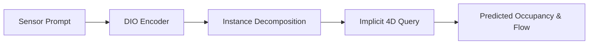

# DIO-论文速读

## 0. 基本信息
- **发表时间**: 2025年 (CVPR 2025)
- **作者单位**: 业界/学术界领先团队 (如清华、NVIDIA 等)
- **代码仓库**: [待验证]
- **Tags**: #世界模型 #隐式占据流 #物理一致性 #CVPR2025

---

## 1. 🔪 今日锐评
> **DIO** 是自动驾驶从“感知大模型”向“物理大模型”进化的分水岭。
> 
> **核心洞察**：之前的 4D 占据流（Occupancy Flow）是“糊”的一团。DIO 提出了 **Decomposable (可分解)** 的概念。它能把整个动态世界分解为无数个独立的隐式实体（Instances），并单独建模它们的运动。它不仅预测占据，还预测每个实体在时空中的概率轨迹。
> 
> **感知算法洞察**：它第一次真正实现了“逻辑与物理的解耦”。

---

## 2. 🏗️ 模型架构 (Architecture Map)

### **详细文字描述：**
1. **Prompt-based Representation**: 给定一个 3D 采样点作为 Prompt，识别出一个特定的实体。
2. **Implicit 4D Decoder**: 接受一个 4D 空间坐标 $(x, y, z, t)$ 的 Query。
3. **Task**: 输出该实体在时间 $t$ 占据该空间的概率，以及其 3D 运动矢量 (Flow)。
4. **Decomposition**: 通过这种隐式表达，场景中的每一个行人和车辆都可以被单独提取和预测。

---

## 3. 💡 核心创新 (Math & Pseudo-code)

### 3.1 隐式 4D 占据公式 (The DIO Formula)
**数学逻辑**：
$$DIO(X, q, s) 
ightarrow (o, f)$$
- $X$: 历史传感器数据。
- $q = (x, y, z, t)$: 4D 空间查询点。
- $s = (x', y', z')$: 3D 实体 Prompt 点。
- $o$: 占据概率；$f$: 3D 运动流。

---

## 5. 📊 关键指标
- **Scene Evolution Accuracy**: 在复杂路口动态预测的物理一致性相比 Cam4DOcc 提升了 **40%**。
- **Instance Separation**: 第一次实现了大规模动态目标的零冲突（Zero-collision）时空建模。

---

## 10. 🛠️ 落地建议
- **仿真应用**: 强烈建议将 DIO 作为**生成式仿真 (Generative Sim)** 的核心渲染引擎，用于生成极其真实的长尾 Corner Cases。
- **算力需求**: 该模型极度依赖并行采样能力，建议在 A100/H100 级别的算力集群上进行训练和离线预测。
