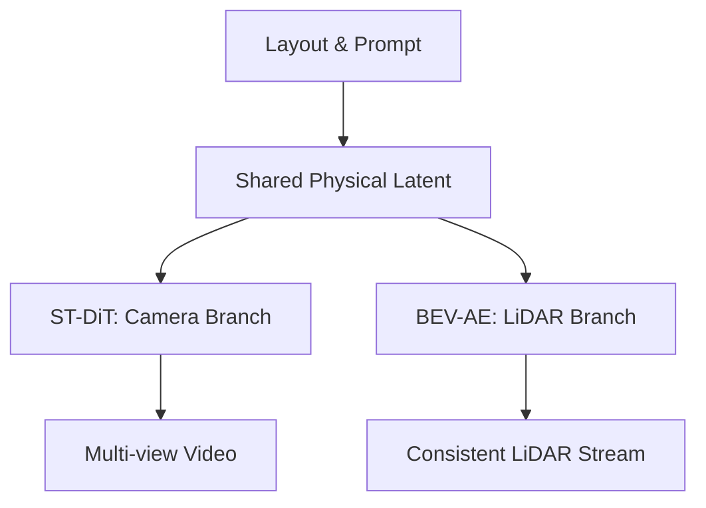

# Genesis-论文速读

## 0. 基本信息
- **发表时间**: 2025年 (NeurIPS 2025)
- **作者单位**: 业界/学术界领先仿真团队
- **代码仓库**: [待验证]
- **Tags**: #多模态生成 #时空一致性 #世界模型 #仿真数据增强

---

## 1. 🔪 今日锐评
> **Genesis** 是对“路测数据昂贵”这一难题的最强力回应。
> 
> **核心洞察**：之前的仿真器要么视频真但 LiDAR 假，要么时空不连贯。Genesis 通过 **Shared Condition Input**，强制让摄像头视频和激光雷达点云在同一个物理潜空间（Latent Space）演化。它生成的长尾场景不仅看起来真实，连物理碰撞逻辑都是一致的。

---

## 2. 🏗️ 模型架构 (Architecture Map)

---

## 3. 💡 核心创新 (Math & Pseudo-code)

### 3.1 跨模态一致性 Loss
**数学逻辑**：
$$L_{consistency} = \| 	ext{Project}(Latent_{camera}) - 	ext{Project}(Latent_{LiDAR}) \|^2$$
- 通过共享物理条件（Layout），确保生成的像素与点云在 BEV 空间重叠。

---

## 10. 🛠️ 落地建议
- **数据回灌**: 建议将 Genesis 生成的长尾场景（如：夜晚雨天的动物横穿）与真实数据按 **3:7** 比例混合训练，可显著提升感知的 Robustness。
